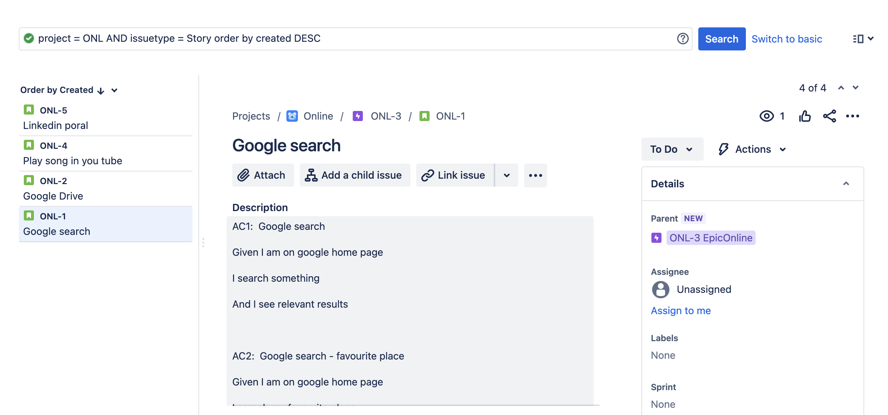
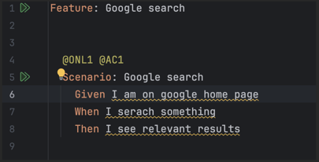
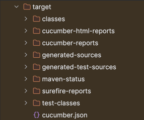
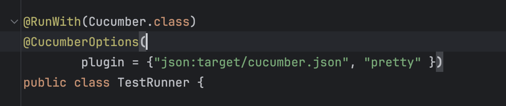
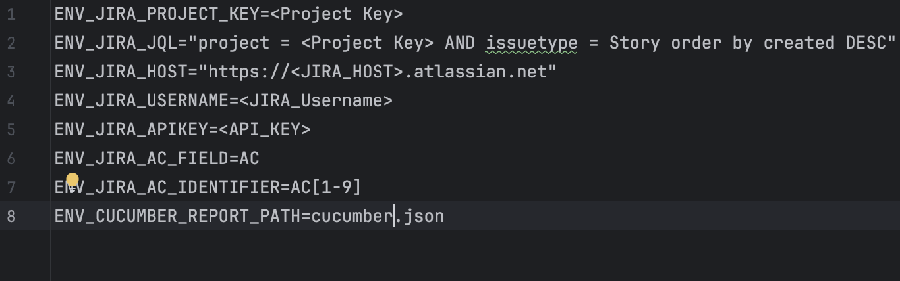
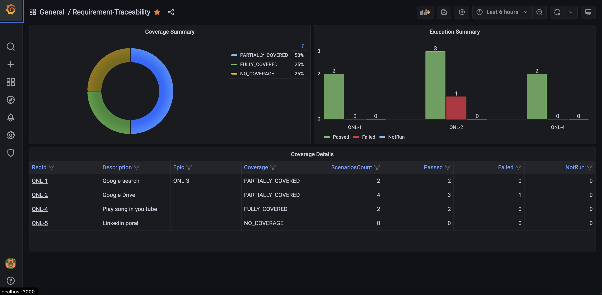
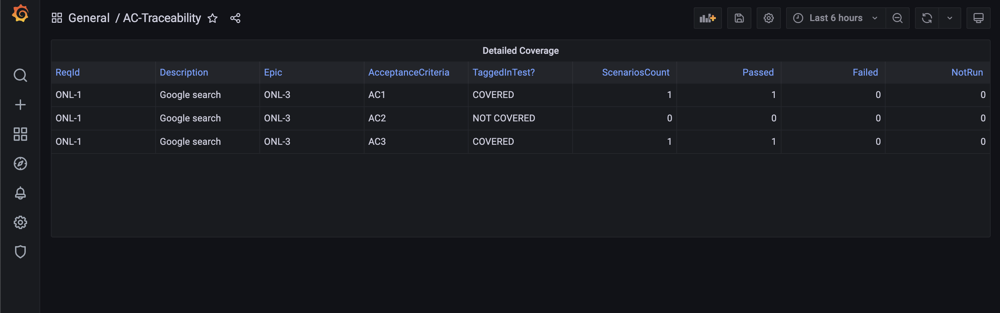
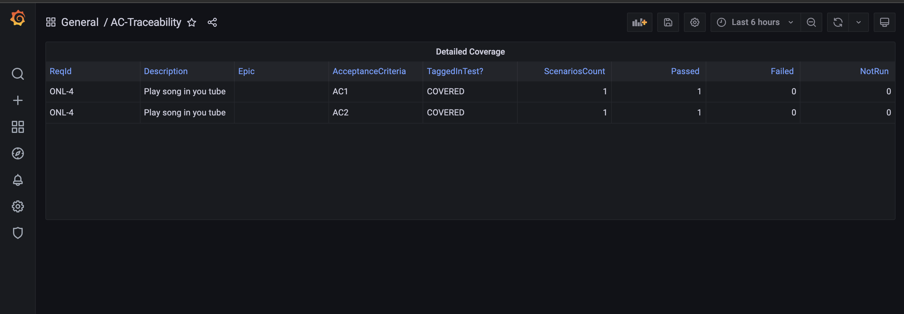

# BDD Automated Requirement Traceability Generator
This Repository contains instructions to use Automated Test Traceability Generator Utility.

## Prerequisites
Before using this utility, make sure you have the following:

* JIRA:
    * Access to JIRA
    * Acceptance Criteria : Should have unique identfier 
    
    sample JIRA JQL, Stories and Description
    


* Automation Suite:
    * Cucumber Feature: Scenarios is required to add tags with Story ID and AC
    * Cucumber JSON: JSON output is ready from automation suite
    * Rename Cucumber JSON file name to -> CucumberTestReport.json

    sample feature file and json report
  
    
    
    
    * Sample configuration in cucumber to generate json report

    https://cucumber.io/docs/cucumber/reporting/?sbsearch=report&lang=java
    


* Docker

* Docker Compose

## Setup 

Clone this repository:
```
git clone 
```

## Configuration

The utility uses a Docker Compose file for container orchestration and a `.env` file for configuration. Follow these steps to set up the configuration:

**Edit `.env` file:** in the root of your project and set the necessary environment variables. 
Here's Description:

| Parameter              | Description                    |
| :--------              | :-------------------------     |
| `ENV_JIRA_PROJECT_KEY` | **Required**. JIRA Project key |
| `ENV_JIRA_JQL`         | **Required**. JIRA JQL Query   |
| `ENV_JIRA_HOST`        | **Required**. JIRA HOST URL    |
| `ENV_JIRA_USERNAME`    | **Required**. JIRA Username    |
| `ENV_JIRA_APIKEY`      | **Required**. JIRA API Key     |
| `ENV_JIRA_AC_FIELD`    | **Required**. JIRA Acceptance Criteria Field     |
| `ENV_JIRA_AC_IDENTIFIER`    | **Required**. JIRA Acceptance Criteria Identifier  e.g. AC[1-9] |
| `ENV_CUCUMBER_REPORT_PATH`      | **Required**. JSON File path from Cucumber     |

  * Sample Env file 
  

## Usage

To Generate Tracebility Reports 

#### For MAC (Apple silicon ) 
```
docker-compose -f docker-compose_mac.yml up
```

#### For Other Platforms

```
docker-compose up
```

## Access Reports via Grafana Dashboard

#### Dashboard URL 

```http
  http://localhost:3000
```

Login Using `admin` and `admin` credentials

This will redirect to Requirement-Traceability Dashboard 

#### Sample reference of reports
#### Main Dashboard



#### click on each story to view detailed coverage





* Note: Can use grafana filters as per the need 
